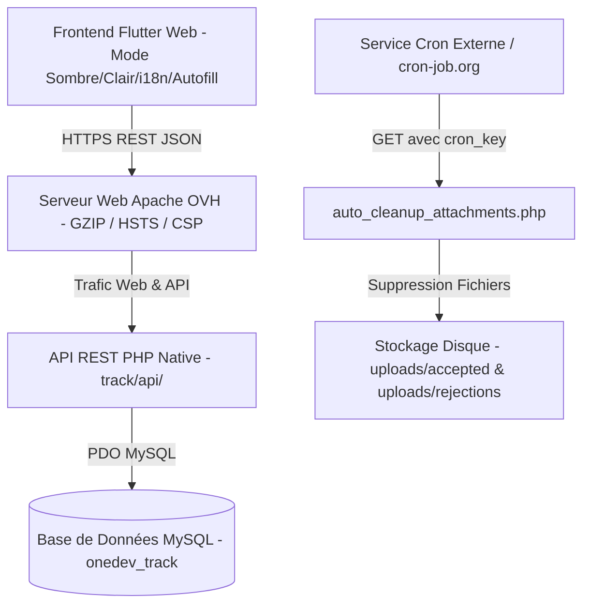

# 🚀 OneDev Track — Portail de Suivi de Projets Freelance & Clients (v1.0.1+2)

[](https://flutter.dev)
[](https://php.net)
[](https://mysql.com)
[](https://pagespeed.web.dev)
[](https://owasp.org)

**OneDev Track** est une plateforme SaaS web moderne, ultra-rapide et trilingue dédiée au suivi de projets, à la collaboration client, au contrôle des étapes de livraison et à l'archivage automatique des pièces jointes.

🌐 **Déploiement en Production :** [https://onedev.ovh/track/](https://onedev.ovh/track/)

---

## 🌟 Fonctionnalités Majeures (Features)

### 👨‍💼 Panneau d'Administration (Admin Dashboard)
* **Tableau de Bord Exécutif à 6 KPI** : Statistiques en temps réel (Projets totaux, Clients, Validations de plan, Refus, Livraisons finales approuvées, Remarques de réception).
* **Moteur CRM & Sélection de Langue Préférée** : Profils clients complets alimentés par `ArabLocationsData` avec possibilité d'attribuer la langue par défaut de l'interface (🇸🇦 **Arabe**, 🇬🇧 **Anglais**, 🇫🇷 **Français**).
* **Gestion des Projets & Identifiant Référentiel `#ID-xx`** : Attribution d'un numéro d'identifiant unique à chaque projet affiché sur toutes les cartes et récapitulatifs.
* **Réinitialisation de Livraison Finale & Purge Cascade** : Réinitialisation du statut de livraison en cas de révision, et suppression en cascade intégrale (fichiers disques, dossiers du projet, tâches, révisions et pièces jointes).
* **Arborescence Hiérarchique des Tâches (3 Niveaux)** : Phases principales $\rightarrow$ Sous-tâches $\rightarrow$ Tâches détaillées avec complétion automatique.
* **Impression de Certificat Officiel** : Exportation et impression du procès-verbal de livraison finale avec tampon de validation et signatures.

### 👤 Portail Client (Client Dashboard)
* **Navigateur Multi-Projets Interactif (Project Switcher)** : Affichage d'un carrousel de cartes de tous les projets du client avec jauges de progression, statuts et badges `#ID-xx` pour permuter d'un projet à un autre en 1 clic.
* **Double Flux d'Approbation & Moteur de Notes** :
  1. **Approbation Médiale du Plan Initial** : Dialogue de confirmation avec possibilité d'ajouter des directives et de joindre des fichiers/images enregistrés dans le dossier serveur dédié `uploads/accepted/project_{id}/`.
  2. **Validation Finale de Livraison (100% Complété)** : Signature et validation officielle de réception avec remarques et recommandations du client.
* **Support Trilingue & Persistance de la Langue** : Conversion dynamique instantanée de la langue de l'interface et enregistrement automatique de la préférence dans la base de données.

### ⏱️ Nettoyage Automatique du Serveur & Intégration Cron Job
* **Gestion de Rétention des Fichiers** : Définition dynamique de la durée de conservation des pièces jointes (ex. 30 jours) et de la taille maximale des fichiers (ex. 30 MB).
* **Token de Sécurité Dynamique (Générateur Aléatoire 🎲)** : Génération d'un token cryptographique (`cron_secret_token`) pour sécuriser les appels Cron distants.
* **Script de Nettoyage Automatique (`auto_cleanup_attachments.php`)** : Supprime les fichiers physiquement (`@unlink`) et nettoie les dossiers vides des projets validés tout en conservant l'historique d'archivage dans la base de données (`file_deleted = 1`).
* **Intégration `cron-job.org` & Test Moteur Média** : URL de déclenchement prête avec modal de test d'exécution en direct affichant un rapport JSON détaillé (fichiers mémorisés, dossiers supprimés, horodatage).

### ⚡ Performances, SEO & IA Readiness (PageSpeed 98/100)
* **Préconnexion Google Fonts** (`fonts.googleapis.com` & `fonts.gstatic.com`) pour le chargement instantané de la police **Cairo**.
* **Fichiers de Référencement & IA** :
  * `sitemap.xml` : Plan de site XML dynamique.
  * `robots.txt` : Directives de balayage pour les moteurs de recherche.
  * `llms.txt` & `ai-catalog.json` : Spécifications ARD pour l'indexation par les agents IA.
* **Accessibilité HTML5 ARIA** : Repère principal `<main role="main">` conforme aux normes W3C.

---

## 📐 Architecture du Système & Déploiement



---

## 📂 Structure du Projet (Bundled Architecture)

```text
onedev_track/
├── web/                        # Racine du Build Web & API Intégrée
│   ├── index.html              # Shell HTML5 ARIA & Preloader
│   ├── robots.txt              # Directives Robots
│   ├── sitemap.xml             # Plan de site XML
│   ├── llms.txt                # Fichier Spécification IA
│   ├── ai-catalog.json         # Manifeste AI Catalog ARD
│   ├── .htaccess               # Règles Réécriture SPA, GZIP et HSTS
│   └── api/                    # Backend API REST PHP PDO
│       ├── config/             # (db.php, cors.php)
│       ├── auth/               # (login.php, verify.php, change_password.php)
│       ├── admin/              # (projects.php, settings.php, delete_project.php, auto_cleanup_attachments.php...)
│       └── client/             # (project.php, upload_attachment.php, change_language.php...)
├── lib/                        # Code Source Flutter Web (Dart)
│   ├── main.dart               # Point d'Entrée & Gestionnaire de Thème/Langue
│   ├── models/                 # Modèles (Project, Task, ClientUser, ProjectAttachment)
│   ├── services/               # (api_service.dart, app_localizations.dart)
│   └── screens/                # (admin_dashboard, client_dashboard, admin_clients_screen...)
├── deploy.cmd                  # Script de Déploiement WinSCP SFTP Automatique
└── pubspec.yaml                # Configuration des Dépendances & Version v1.0.1+2
```

---

## 🗄️ Migration de la Base de Données (SQL)

Exécutez la requête SQL ci-dessous pour mettre à jour la base de données :

```sql
USE `onedev_track`;

-- Ajouter la colonne de langue préférée pour chaque client
ALTER TABLE users ADD COLUMN preferred_language VARCHAR(10) DEFAULT 'ar' AFTER role;

-- Ajouter la colonne d'archivage physique pour les pièces jointes
ALTER TABLE project_attachments ADD COLUMN file_deleted TINYINT(1) DEFAULT 0 AFTER file_size;

-- Insérer les paramètres système par défaut
INSERT INTO `system_settings` (`setting_key`, `setting_value`) VALUES
('max_attachments_count', '5'),
('max_file_size_mb', '30'),
('auto_delete_attachments_days', '30'),
('cron_secret_token', 'ONEDEV_CLEANUP_CRON_2026_SECURE')
ON DUPLICATE KEY UPDATE `setting_key`=`setting_key`;
```

---

## ⚡ Pipeline de Compilation et Déploiement en 1 Clic

### 1. Compilation Web
```bash
flutter build web --base-href "/track/"
```

### 2. Déploiement Automatique via `deploy.cmd`
```cmd
deploy.cmd
```
Le script synchronise automatiquement le dossier `build/web/` vers `/home/debian/public_html/track/` sur le serveur distant OVH via WinSCP SFTP.

---

## 📄 Licence & Crédits

Copyright © 2026 **OneDev IT**. Tous droits réservés.  
Logiciel Propriétaire — Usage et distribution réservés.
