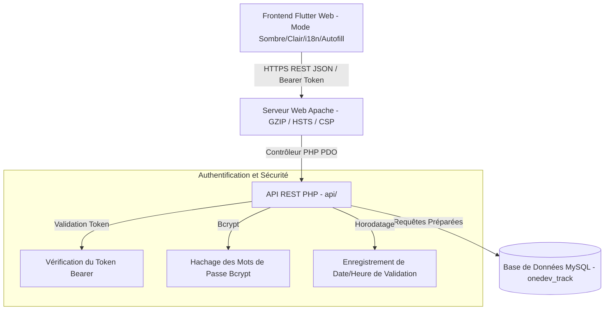

# 🚀 OneDev Track — Portail de Suivi de Projets Freelance & Clients

[](https://flutter.dev)
[](https://php.net)
[](https://mysql.com)
[](https://httpd.apache.org)
[](https://owasp.org)

**OneDev Track** est un portail de suivi de projets et de gestion de clients multi-entreprises de niveau entreprise. Conçu pour les agences de développement, les développeurs et les freelancers, il offre une interface ultra-réactive pour la gestion des projets, la validation des étapes, le suivi des tâches hiérarchiques, l'impression de certificats de livraison et la prévisualisation des spécifications de projet.

---

## 🌟 Fonctionnalités Clés

### 👨‍💼 Panneau d'Administration (Admin Dashboard)
* **Tableau de Bord Exécutif à 6 KPI** : Statistiques en temps réel sur les projets totaux, les clients, les validations de plan, les refus, les livraisons finales approuvées et les remarques de réception.
* **Moteur CRM & Localisation Client** : Profils clients complets alimentés par le dictionnaire autonome `ArabLocationsData` (Ligue Arabe intégrale + Pays internationaux).
* **Gestion des Projets & Réinitialisation de Livraison** : Création, édition, attribution, suivi du délai, et capacité de **réinitialiser le statut de livraison finale** en cas d'erreur ou de révision.
* **Arborescence Hiérarchique des Tâches (3 Niveaux)** : Phases principales $\rightarrow$ Sous-tâches $\rightarrow$ Tâches détaillées. Complétion automatique en cascade des tâches parentes et réinitialisation statutaire.
* **Impression de Certificat Officiel** : Impression et exportation en PDF de la شهادة ومحضر الاستلام النهائي avec tampon de validation et signatures.

### 👤 Portail Client (Client Dashboard)
* **Espace Multi-Projets & Taux d'Avancement Réactif** : Connexion unique pour le client avec possibilité de basculer de manière fluide entre tous ses projets attribués.
* **Double Flux d'Approbation (Initial & Final)** :
  1. **Approbation Médiale du Plan** : Validation initiale du cahier des charges et des tâches.
  2. **Validation Finale de Livraison (100% Complété)** : Signature et validation officielle de réception du projet livré ou soumission de remarques de livraison.
* **Certificat Officiel Imprimable** : Impression du procès-verbal de livraison avec sceau officiel et horodatage précis.
* **Chronologie et Aperçu Interactif** : Progression en temps réel, compteur de jours ouvrables et affichage des détails du projet.

### 🌐 Internationalisation, Sécurité & UX
* **Support Trilingue Complet (AR / EN / FR)** :
  * 🇸🇦 **Arabe** (Par défaut, RTL)
  * 🇬🇧 **Anglais** (LTR)
  * 🇫🇷 **Français** (LTR)
  * *Changement de langue instantané et réactif sans rechargement de page.*
* **Sécurité & Sauvegarde des Identifiants** :
  * Toggle de visibilité du mot de passe (œil 👁️) sur tous les formulaires.
  * Intégration du gestionnaire de mots de passe des navigateurs (`AutofillGroup` + `TextInput.finishAutofillContext()`).
  * Dialogue de changement de mot de passe autonome pour Admin et Clients.
* **Moteur de Thèmes & Performance** : Mode Sombre Glassmorphism / Mode Clair épuré, préchargeur d'écran sans glyphes d'erreur (`🛈`), et compression GZIP serveur.

---

## 🛠️ Pile Technologique (Tech Stack)

| Couche | Technologie | Composants / Bibliothèques Clés |
| :--- | :--- | :--- |
| **Interface Frontend** | Flutter Web 3.x (Dart) | Material 3, `SharedPreferences`, `Intl`, `ui_web`, `ValueNotifier`, `ArabLocationsData` |
| **API Backend** | Native PHP 8.x (PDO) | API REST JSON, Hachage Bcrypt, Authentification Bearer Token, Horodatage `NOW()` |
| **Base de Données** | MySQL 8.x / MariaDB | Schéma `onedev_track` avec encodage `utf8mb4_unicode_ci` |
| **Serveur & Compression** | Apache 2.4 / Debian | Compression GZIP `mod_deflate`, Cache Navigateur `mod_expires` |
| **Sécurité** | Conforme OWASP | HSTS, Content Security Policy (CSP), X-Frame-Options, Shield CSRF/XSS |

---

## 📐 Architecture du Système



---

## 📂 Structure du Projet

```
onedev_track/
├── api/                        # API REST PHP PDO Native
│   ├── auth/
│   │   ├── login.php           # Authentification et émission de tokens
│   │   ├── verify.php          # Helper de vérification du token Bearer
│   │   └── change_password.php # Endpoint de changement de mot de passe
│   ├── admin/
│   │   ├── projects.php        # Liste et création des projets admin
│   │   ├── edit_project.php    # Modification des projets
│   │   ├── delete_project.php  # Suppression de projets
│   │   ├── clients.php         # Endpoints CRM clients
│   │   ├── edit_client.php     # Édition du profil client
│   │   ├── delete_client.php   # Suppression du profil client
│   │   ├── tasks.php           # Tâches et arborescence
│   │   ├── edit_task.php       # Modification de tâche (titre, description, rapport)
│   │   ├── delete_task.php     # Suppression de tâche
│   │   ├── validate_task.php   # Validation de tâche avec rapport
│   │   └── reset_final_approval.php # Réinitialisation du statut de livraison finale
│   ├── client/
│   │   ├── project.php         # Récupération des projets client & tâches
│   │   ├── update_approval.php # Traitement de l'approbation initiale
│   │   └── update_final_approval.php # Traitement de la livraison finale (100%)
│   ├── config/
│   │   ├── db.php              # Connexion base de données PDO
│   │   └── cors.php            # En-têtes CORS
│   └── .htaccess               # Compression GZIP & En-têtes de sécurité API
│
├── lib/                        # Application Flutter Web
│   ├── main.dart               # Point d'entrée, Thème & Gestionnaire de Langues
│   ├── data/
│   │   └── arab_locations_data.dart # Dictionnaire géographique autonome (22 Pays Arabes)
│   ├── models/
│   │   └── data_models.dart    # Modèles de données Project, Task et ClientUser
│   ├── services/
│   │   ├── api_service.dart    # Client HTTP API centralisé
│   │   └── app_localizations.dart # Dictionnaire Trilingue (AR/EN/FR), Moteur de Certificat & Mot de Passe
│   └── screens/
│       ├── login_screen.dart           # Écran de connexion réactif avec Autofill & Œil 👁️
│       ├── client_dashboard.dart       # Portail Client Pro & Certificat de Livraison
│       ├── admin_dashboard.dart        # Tableau de Bord Admin 6 KPI & Réinitialisation
│       ├── admin_clients_screen.dart   # CRM Client & Sélecteur Géographique
│       └── admin_task_manager.dart     # Gestionnaire Réactif d'Arborescence des Tâches
│
├── web/                        # Actifs Statiques Flutter Web
│   ├── index.html              # Shell HTML avec Méta CSP & Preloader Synchronisé
│   ├── manifest.json           # Manifeste PWA
│   └── .htaccess               # Règles Réécriture SPA, GZIP et HSTS
├── build.cmd                   # Script de compilation automatisé avec Horodatage
└── pubspec.yaml                # Dépendances Flutter & Polices Mises en Cache
```

---

## 🗄️ Configuration de la Base de Données

Exécutez le script SQL complet ci-dessous pour créer ou mettre à jour la base de données `onedev_track` :

```sql
CREATE DATABASE IF NOT EXISTS `onedev_track` 
CHARACTER SET utf8mb4 
COLLATE utf8mb4_unicode_ci;

USE `onedev_track`;

-- Table : Utilisateurs (Administrateurs et Clients)
CREATE TABLE IF NOT EXISTS `users` (
  `id` INT AUTO_INCREMENT PRIMARY KEY,
  `username` VARCHAR(100) NOT NULL UNIQUE,
  `password` VARCHAR(255) NOT NULL,
  `full_name` VARCHAR(255) NULL,
  `role` ENUM('admin', 'client') NOT NULL DEFAULT 'client',
  `country` VARCHAR(100) NULL,
  `state` VARCHAR(100) NULL,
  `city` VARCHAR(100) NULL,
  `company_name` VARCHAR(255) NULL,
  `created_at` TIMESTAMP DEFAULT CURRENT_TIMESTAMP
) ENGINE=InnoDB DEFAULT CHARSET=utf8mb4 COLLATE=utf8mb4_unicode_ci;

-- Table : Projets
CREATE TABLE IF NOT EXISTS `projects` (
  `id` INT AUTO_INCREMENT PRIMARY KEY,
  `client_id` INT NOT NULL,
  `title` VARCHAR(255) NOT NULL,
  `description` TEXT NULL,
  `start_date` DATE NOT NULL,
  `duration_days` INT NOT NULL,
  `deadline` DATE NOT NULL,
  `client_approval_status` ENUM('pending', 'approved', 'rejected') DEFAULT 'pending',
  `client_rejection_reason` TEXT NULL,
  `client_approval_date` DATETIME NULL,
  `final_approval_status` ENUM('pending', 'approved', 'rejected') DEFAULT 'pending',
  `final_approval_notes` TEXT NULL,
  `final_approval_date` DATETIME NULL,
  `created_at` TIMESTAMP DEFAULT CURRENT_TIMESTAMP,
  FOREIGN KEY (`client_id`) REFERENCES `users`(`id`) ON DELETE CASCADE
) ENGINE=InnoDB DEFAULT CHARSET=utf8mb4 COLLATE=utf8mb4_unicode_ci;

-- Table : Tâches (Arborescence Hiérarchique)
CREATE TABLE IF NOT EXISTS `tasks` (
  `id` INT AUTO_INCREMENT PRIMARY KEY,
  `project_id` INT NOT NULL,
  `parent_id` INT NULL,
  `title` VARCHAR(255) NOT NULL,
  `description` TEXT NULL,
  `status` ENUM('pending', 'completed') DEFAULT 'pending',
  `notes` TEXT NULL,
  `completed_at` TIMESTAMP NULL,
  `created_at` TIMESTAMP DEFAULT CURRENT_TIMESTAMP,
  FOREIGN KEY (`project_id`) REFERENCES `projects`(`id`) ON DELETE CASCADE,
  FOREIGN KEY (`parent_id`) REFERENCES `tasks`(`id`) ON DELETE CASCADE
) ENGINE=InnoDB DEFAULT CHARSET=utf8mb4 COLLATE=utf8mb4_unicode_ci;

-- Insertion du compte Administrateur Principal (Mot de passe : admin123)
INSERT INTO `users` (`username`, `password`, `full_name`, `role`) 
VALUES ('admin', '$2y$10$92IXUNPKjO0rOQ5byMi.Ye4oKoEa3Ro9llC/.og/at2.uheWG/igi', 'OneDev Admin', 'admin')
ON DUPLICATE KEY UPDATE `id`=`id`;
```

---

## ⚡ Instructions de Compilation et Déploiement

### 1. Compilation Automatisée via `build.cmd`
Vous pouvez exécuter le script Windows `build.cmd` qui effectue la compilation et affiche la date/heure de fin :
```cmd
build.cmd
```
Ou manuellement via Flutter CLI :
```bash
flutter build web --base-href "/track/"
```

### 2. Déploiement sur le Serveur
1. Copiez le contenu de `build/web/` vers `/var/www/html/track/`.
2. Copiez le dossier `api/` vers `/var/www/html/api/`.
3. Configurez `api/config/db.php` avec vos identifiants SQL.

---

## 📄 Licence

Copyright © 2026 **OneDev IT**. Tous droits réservés.  
Logiciel Propriétaire — Usage et distribution réservés.
