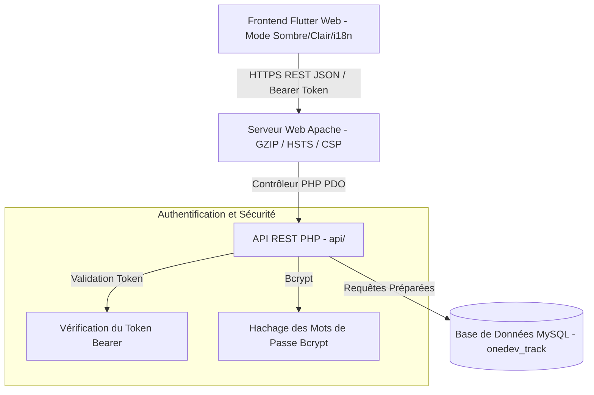

# 🚀 OneDev Track — Portail de Suivi de Projets Freelance & Clients

[](https://flutter.dev)
[](https://php.net)
[](https://mysql.com)
[](https://httpd.apache.org)
[](https://owasp.org)

**OneDev Track** est un portail de suivi de projets et de gestion de clients multi-entreprises de niveau entreprise. Conçu pour les agences de développement, les développeurs et les freelancers, il offre une interface ultra-réactive pour la gestion des projets, l'approbation des clients, le suivi des tâches hiérarchiques et la prévisualisation interactive des spécifications de projet.

---

## 🌟 Fonctionnalités Clés

### 👨‍💼 Fonctionnalités d'Administration (Panneau Admin)
* **Tableau de Bord Exécutif KPI** : Statistiques en temps réel sur les projets totaux, les clients actifs, les validations en attente et les demandes de révision des clients.
* **Moteur CRM & Localisation Client** : Profils clients complets avec sélecteurs en cascade automatiques pour **les 22 pays membres de la Ligue Arabe** et les pays internationaux avec leurs régions/gouvernorats et villes respectifs.
* **Gestion Intelligente des Projets** : Attribution des projets aux clients, calcul automatique des dates limites et intégration de spécifications de projets interactives en HTML/CSS/JS.
* **Arborescence Hiérarchique des Tâches (3 Niveaux)** : Organisation du travail en Phase Principale $\rightarrow$ Sous-tâche $\rightarrow$ Tâche Détaillée. Complétion automatique en cascade des tâches parentes et réinitialisation statutaire.
* **Gestion des Retours Clients** : Consultation directe des notes de refus et des demandes de modifications des clients sur les cartes de projet.

### 👤 Fonctionnalités du Portail Client
* **Espace Multi-Projets** : Connexion unique pour le client avec possibilité de basculer de manière fluide entre tous ses projets attribués via un sélecteur d'en-tête.
* **Flux d'Approbation et de Refus** : Approbation du plan de projet ou demande de modifications avec remarques détaillées.
* **Chronologie des Tâches en Temps Réel** : Jauge de progression visuelle, compteur de jours ouvrables restants et indicateurs de statut des tâches.
* **Aperçu Style macOS Browser Mockup** : Rendu en direct des spécifications de projet interactives en HTML/CSS/JS dans un cadre sécurisé de type متصفح macOS.

### 🌐 Internationalisation & Excellence UX
* **Support Trilingue Complet (AR / EN / FR)** :
  * 🇸🇦 **Arabe** (Par défaut, RTL)
  * 🇬🇧 **Anglais** (LTR)
  * 🇫🇷 **Français** (LTR)
  * *Changement de langue instantané et réactif sans rechargement de page.*
* **Moteur de Thèmes Professionnel** : Mode Sombre Glassmorphism et Mode Clair épuré avec sauvegarde permanente dans `SharedPreferences`.
* **Sécurité Autonome des Comptes** : Dialogue de changement de mot de passe en libre-service pour les administrateurs et les clients.
* **Interface 100% Responsive** : Disposition adaptée aux écrans Ordinateur, Tablette et Mobile sans aucun dépassement horizontal.

---

## 🛠️ Pile Technologique (Tech Stack)

| Couche | Technologie | Composants / Bibliothèques Clés |
| :--- | :--- | :--- |
| **Interface Frontend** | Flutter Web 3.x (Dart) | Material 3, `SharedPreferences`, `Intl`, `ui_web`, `ValueNotifier` |
| **API Backend** | Native PHP 8.x (PDO) | API REST JSON, Hachage Bcrypt, Authentification Bearer Token |
| **Base de Données** | MySQL 8.x / MariaDB | Schéma `onedev_track` avec encodage `utf8mb4_unicode_ci` |
| **Serveur & Compression** | Apache 2.4 / Debian | Compression GZIP `mod_deflate`, Cache Navigateur `mod_expires` |
| **Sécurité** | Conforme OWASP | HSTS, Content Security Policy (CSP), X-Frame-Options, Shield CSRF/XSS |

---

## 📐 Architecture du Système



---

## 📂 Structure du Projet

```
onedev_track/
├── api/                        # API REST PHP PDO Native
│   ├── auth/
│   │   ├── login.php           # Authentification et émission de tokens
│   │   ├── verify.php          # Helper de vérification du token Bearer
│   │   └── change_password.php # Endpoint de changement de mot de passe
│   ├── admin/
│   │   ├── projects.php        # Création et liste des projets admin
│   │   ├── edit_project.php    # Mise à jour des détails du projet
│   │   ├── delete_project.php  # Suppression du projet et en cascade
│   │   ├── clients.php         # Endpoints CRM clients
│   │   ├── edit_client.php     # Édition du profil client
│   │   ├── delete_client.php   # Suppression du profil client
│   │   ├── tasks.php           # Création de tâches et récupération de l'arbre
│   │   ├── edit_task.php       # Éditeur de tâches
│   │   ├── delete_task.php     # Suppression de tâches
│   │   └── validate_task.php   # Validation de tâches et complétion en cascade
│   ├── client/
│   │   ├── project.php         # Récupération des projets & tâches du client
│   │   └── update_approval.php # Traitement de l'approbation/refus du client
│   ├── config/
│   │   ├── db.php              # Classe de connexion à la base de données PDO
│   │   └── cors.php            # Configuration des en-têtes CORS
│   └── .htaccess               # Compression GZIP & En-têtes de sécurité API
│
├── lib/                        # Application Flutter Web
│   ├── main.dart               # Point d'entrée, Thème & Gestionnaire de Langues
│   ├── models/
│   │   └── data_models.dart    # Modèles de données Project, Task et ClientUser
│   ├── services/
│   │   ├── api_service.dart    # Client HTTP API centralisé
│   │   └── app_localizations.dart # Dictionnaire Trilingue (AR/EN/FR) & Dialogue Mot de Passe
│   └── screens/
│       ├── login_screen.dart           # Écran de connexion réactif
│       ├── client_dashboard.dart       # Portail Client Pro & Aperçu Iframe
│       ├── admin_dashboard.dart        # Tableau de Bord Admin & Formulaires Modaux
│       ├── admin_clients_screen.dart   # CRM Client & Moteur de Localisation
│       └── admin_task_manager.dart     # Gestionnaire d'Arborescence des Tâches
│
├── web/                        # Actifs Statiques Flutter Web
│   ├── index.html              # Shell HTML avec balises Méta CSP
│   ├── manifest.json           # Manifeste PWA
│   └── .htaccess               # Règles Réécriture SPA, GZIP et HSTS
└── pubspec.yaml                # Configuration des dépendances Flutter
```

---

## 🗄️ Configuration de la Base de Données

Exécutez les commandes SQL suivantes pour initialiser la base de données `onedev_track` :

```sql
CREATE DATABASE IF NOT EXISTS `onedev_track` 
CHARACTER SET utf8mb4 
COLLATE utf8mb4_unicode_ci;

USE `onedev_track`;

-- Table : Utilisateurs (Administrateurs et Clients)
CREATE TABLE IF NOT EXISTS `users` (
  `id` INT AUTO_INCREMENT PRIMARY KEY,
  `username` VARCHAR(100) NOT NULL UNIQUE,
  `password` VARCHAR(255) NOT NULL,
  `full_name` VARCHAR(255) NULL,
  `role` ENUM('admin', 'client') NOT NULL DEFAULT 'client',
  `country` VARCHAR(100) NULL,
  `state` VARCHAR(100) NULL,
  `city` VARCHAR(100) NULL,
  `company_name` VARCHAR(255) NULL,
  `created_at` TIMESTAMP DEFAULT CURRENT_TIMESTAMP
) ENGINE=InnoDB DEFAULT CHARSET=utf8mb4 COLLATE=utf8mb4_unicode_ci;

-- Table : Projets
CREATE TABLE IF NOT EXISTS `projects` (
  `id` INT AUTO_INCREMENT PRIMARY KEY,
  `client_id` INT NOT NULL,
  `title` VARCHAR(255) NOT NULL,
  `description` TEXT NULL,
  `start_date` DATE NOT NULL,
  `duration_days` INT NOT NULL,
  `deadline` DATE NOT NULL,
  `client_approval_status` ENUM('pending', 'approved', 'rejected') DEFAULT 'pending',
  `client_rejection_reason` TEXT NULL,
  `created_at` TIMESTAMP DEFAULT CURRENT_TIMESTAMP,
  FOREIGN KEY (`client_id`) REFERENCES `users`(`id`) ON DELETE CASCADE
) ENGINE=InnoDB DEFAULT CHARSET=utf8mb4 COLLATE=utf8mb4_unicode_ci;

-- Table : Tâches (Arborescence Hiérarchique)
CREATE TABLE IF NOT EXISTS `tasks` (
  `id` INT AUTO_INCREMENT PRIMARY KEY,
  `project_id` INT NOT NULL,
  `parent_id` INT NULL,
  `title` VARCHAR(255) NOT NULL,
  `description` TEXT NULL,
  `status` ENUM('pending', 'completed') DEFAULT 'pending',
  `notes` TEXT NULL,
  `completed_at` TIMESTAMP NULL,
  `created_at` TIMESTAMP DEFAULT CURRENT_TIMESTAMP,
  FOREIGN KEY (`project_id`) REFERENCES `projects`(`id`) ON DELETE CASCADE,
  FOREIGN KEY (`parent_id`) REFERENCES `tasks`(`id`) ON DELETE CASCADE
) ENGINE=InnoDB DEFAULT CHARSET=utf8mb4 COLLATE=utf8mb4_unicode_ci;

-- Insertion du compte Administrateur Principal (Mot de passe : admin123)
INSERT INTO `users` (`username`, `password`, `full_name`, `role`) 
VALUES ('admin', '$2y$10$92IXUNPKjO0rOQ5byMi.Ye4oKoEa3Ro9llC/.og/at2.uheWG/igi', 'OneDev Admin', 'admin')
ON DUPLICATE KEY UPDATE `id`=`id`;
```

---

## ⚡ Instructions de Compilation et Déploiement

### 1. Compilation de Flutter Web
Exécutez la commande de compilation Web Flutter en spécifiant le chemin de base cible :
```bash
flutter build web --base-href "/track/"
```

### 2. Déploiement sur le Serveur
1. Copiez le contenu du dossier `build/web/` vers le répertoire `/var/www/html/track/`.
2. Copiez le dossier `api/` vers `/var/www/html/api/`.
3. Configurez le fichier `api/config/db.php` avec les identifiants de votre base de données.

### 3. Activation des Modules Apache
Exécutez les commandes suivantes sur votre VPS Debian/Ubuntu :
```bash
sudo a2enmod rewrite deflate headers expires
sudo systemctl restart apache2
```

---

## 🔒 Fonctionnalités de Sécurité et Performance

* **Compression GZIP** : Compresse les fichiers statiques `.js`, `.css` et `.json` jusqu'à 80%, réduisant la taille du transfert de ~18 Ko à ~6.8 Ko.
* **Content Security Policy (CSP)** : Politique renforcée pour Flutter CanvasKit, Google Fonts et les connexions API internes.
* **HSTS (HTTP Strict Transport Security)** : Impose le chiffrement HTTPS pour l'ensemble du trafic.
* **Protection Clickjacking & MIME** : Inclus les en-têtes `X-Frame-Options: SAMEORIGIN` et `X-Content-Type-Options: nosniff`.
* **Session par Token** : Token avec expiration de 24 heures sauvegardé de façon sécurisée dans `SharedPreferences`.

---

## 📄 Licence

Copyright © 2026 **OneDev IT**. Tous droits réservés.  
Logiciel Propriétaire — Distribution autorisée uniquement sur licence.
